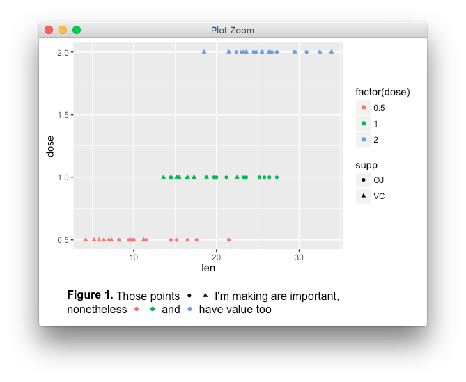

# caption
Inserting plotting symbols in figure captions.

**NOTE: just ideas, not actually implemented.**


```
template <- "**Figure 1.** Those points {{supp %in% c('VC', 'OJ'))}} I'm making 
are important, nonetheless {{dose == 0.5}} {{dose == 1.0}} and {{dose == 2.0}} 
have value too."
glyphs <- extract_legend_grobs(p)

print(caption(template, glyphs), type = "latex")
# \textb{Figure 1.} Those points \includegraphics{captionfigs/p_1.png} I'm
# making are important, nonetheless \includegraphics{captionfigs/p_2.png} 
# \includegraphics{captionfigs/p_3.png} and 
# \includegraphics{captionfigs/p_4.png} have value too.
 
print(caption(template, glyphs), type = "grid")

```




Motivated by http://stackoverflow.com/q/35936319/471093